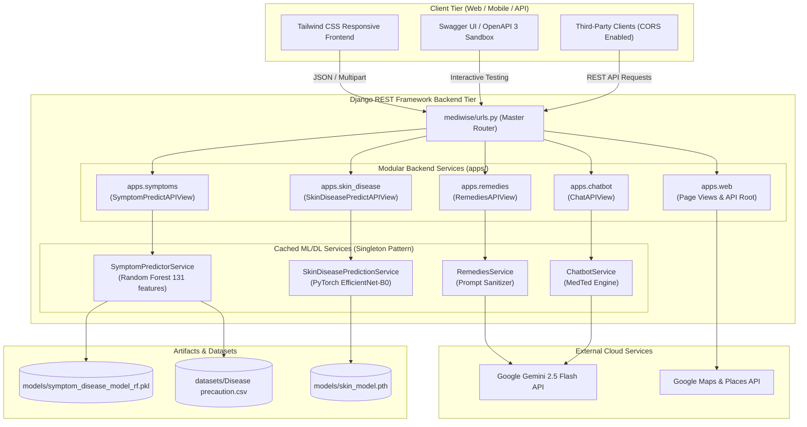

# MEDiWiSE — A Digital Health Assistant

An AI-powered digital healthcare platform delivering machine-learning symptom predictions, deep-learning skin condition classification, natural home remedies, and conversational health guidance — built on a high-performance **Django REST Framework (DRF)** backend with a responsive **Tailwind CSS** frontend.

---

## Architecture & Data Flow



---

## Features

- **Symptom-Based Disease Prediction (ML)** — Random Forest model evaluates patient-entered symptoms against 131 clinical features to output predicted conditions, accuracy percentages, and immediate precautions.
- **Visual Skin Condition Detection (DL)** — Convolutional neural network (PyTorch EfficientNet-B0) classifies skin conditions across 7 dermatological categories from uploaded images.
- **Home Remedies Assistant (Generative AI)** — Gemini AI (`gemini-2.5-flash`) generates evidence-informed, non-pharmacological self-care remedies for mild symptoms.
- **MedTed Health Chatbot (AI)** — Empathetic 24/7 conversational companion for general wellness, first-aid tips, and health queries.
- **Interactive Swagger UI Sandbox** — In-browser testing suite for developers and clients with pre-configured request payloads.
- **Emergency Dispatch & Clinic Locator** — Direct one-tap 108 emergency dialing and interactive Google Maps GPS hospital/pharmacy locator.
- **Modern Responsive UI** — Built with Tailwind CSS, clinical slate navy palette, fluid mobile navigation, and real-time status indicators.

---

## Tech Stack

| Layer                 | Technology                                                   |
| --------------------- | ------------------------------------------------------------ |
| **Backend Framework** | Python 3.12+, Django 6.x, Django REST Framework (DRF)        |
| **API Documentation** | OpenAPI 3.0, `drf-spectacular` (Swagger UI & Redoc)          |
| **CORS & Security**   | `django-cors-headers`, environment secret injection          |
| **ML Model**          | Scikit-learn (Random Forest Classifier, MultiLabelBinarizer) |
| **DL Model**          | PyTorch, Torchvision (EfficientNet-B0 Architecture)          |
| **Generative AI**     | Google Gemini API (`models/gemini-2.5-flash`)                |
| **Maps & Places**     | Google Maps JavaScript API                                   |
| **Frontend**          | HTML5, Tailwind CSS, Jinja2 Template Engine                  |

---

## Project Structure

```
UI-MEDiWiSE(final)/
├── manage.py                  # Django CLI management script
├── mediwise/                  # Django project core configuration
│   ├── settings.py            # App settings, DRF, CORS, static/media & spectacular config
│   ├── urls.py                # Master URL routing table
│   ├── jinja2.py              # Jinja2 environment (Flask url_for compatibility)
│   ├── wsgi.py                # WSGI entry for production deployment
│   └── asgi.py                # ASGI entry for asynchronous deployment
├── apps/                      # Modular backend applications
│   ├── symptoms/              # ML Symptom Prediction service
│   │   ├── services.py        # Singleton Random Forest inference engine
│   │   ├── serializers.py     # Request/response validation schemas
│   │   ├── views.py           # POST /api/predict_symptoms/
│   │   ├── urls.py            # Route mappings
│   │   └── tests.py           # Automated test suite
│   ├── skin_disease/          # Deep Learning Skin Disease service
│   │   ├── services.py        # Singleton EfficientNet-B0 inference engine
│   │   ├── serializers.py     # Image upload validation & response schema
│   │   ├── views.py           # POST /api/predict_skin/ (multipart/form-data)
│   │   ├── urls.py            # Route mappings
│   │   └── tests.py           # Automated test suite
│   ├── remedies/              # Gemini AI Remedies service
│   │   ├── services.py        # Gemini client & prompt formatting
│   │   ├── serializers.py     # Request/response schemas
│   │   ├── views.py           # POST /api/get_remedies/
│   │   ├── urls.py            # Route mappings
│   │   └── tests.py           # Automated test suite
│   ├── chatbot/               # Gemini AI MedTed Chatbot service
│   │   ├── services.py        # Conversational assistant client
│   │   ├── serializers.py     # Request/response schemas
│   │   ├── views.py           # POST /api/chat/
│   │   ├── urls.py            # Route mappings
│   │   └── tests.py           # Automated test suite
│   └── web/                   # Web presentation & API discovery
│       ├── views.py           # Template rendering views & /api/ directory
│       ├── urls.py            # Route mappings (/, /index.html, etc.)
│       └── tests.py           # Web route tests
├── models/                    # Trained model weights
│   ├── symptom_disease_model_rf.pkl
│   ├── symptom_encoder.pkl
│   ├── label_encoder.pkl
│   └── skin_model.pth
├── datasets/                  # Datasets & precautions
│   └── Disease precaution.csv
├── templates/                 # Modern Tailwind CSS HTML templates
├── static/                    # Static assets (images, icons, styles)
├── requirements.txt           # Pinned backend dependencies
└── .env.sample                # Environment variables template
```

---

## Setup & Running Guide

### 1. Prerequisites

- Python 3.12 or higher
- A Google Gemini API key → [Google AI Studio](https://aistudio.google.com/app/apikey)
- A Google Maps API key → [Google Cloud Console](https://console.cloud.google.com/apis/credentials)

---

### 2. Virtual Environment Setup

```bash
# Clone the repository
git clone https://github.com/01uttamsingh/MEDiWiSE---A-Digital-Health-Assistant-.git
cd MEDiWiSE---A-Digital-Health-Assistant-

# Create virtual environment
python -m venv venv

# Activate on Windows (PowerShell)
.\venv\Scripts\activate

# Activate on macOS/Linux
source venv/bin/activate
```

---

### 3. Install Dependencies

```bash
pip install -r requirements.txt
```

> **PyTorch CPU Note**: On Windows systems without dedicated CUDA, CPU wheels install automatically via `pip install torch torchvision --index-url https://download.pytorch.org/whl/cpu`.

---

### 4. Configure Environment Variables

Copy `.env.sample` to `.env`:

```bash
# Windows
copy .env.sample .env

# macOS / Linux
cp .env.sample .env
```

Open `.env` and fill in your actual API keys:

```env
GEMINI_API_KEY=your_actual_gemini_api_key
GOOGLE_MAPS_API_KEY=your_actual_google_maps_api_key
DJANGO_SECRET_KEY=your_optional_custom_secret_key
DEBUG=True
```

---

### 5. Run Database Migrations & Start Server

Both the Backend REST APIs and the Frontend Web UI run together from a single command:

```bash
# Apply migrations
python manage.py migrate

# Start the development server
python manage.py runserver
```

Open your browser to:

- **Web Application**: [http://localhost:8000/](http://localhost:8000/)
- **Interactive Swagger UI**: [http://localhost:8000/api/docs/](http://localhost:8000/api/docs/) (or `/api/swagger/`)
- **Redoc Documentation**: [http://localhost:8000/api/redoc/](http://localhost:8000/api/redoc/)
- **Raw OpenAPI 3 Schema**: [http://localhost:8000/api/schema/](http://localhost:8000/api/schema/)
- **API Directory**: [http://localhost:8000/api/](http://localhost:8000/api/)
- **Admin Portal**: [http://localhost:8000/admin/](http://localhost:8000/admin/)

---

## API Endpoints & Testing

All endpoints accept requests with and without a trailing slash (e.g. `/api/chat` and `/api/chat/`).

| Endpoint                      | Method | Input Type            | Description                                     |
| ----------------------------- | ------ | --------------------- | ----------------------------------------------- |
| `POST /api/predict_symptoms/` | `POST` | `application/json`    | Predicts condition from a list of symptoms      |
| `POST /api/predict_skin/`     | `POST` | `multipart/form-data` | Classifies skin condition from uploaded image   |
| `POST /api/get_remedies/`     | `POST` | `application/json`    | Fetches Gemini AI home self-care remedies       |
| `POST /api/chat/`             | `POST` | `application/json`    | Conversational MedTed health guidance assistant |
| `GET /api/docs/`              | `GET`  | _None_                | Interactive Swagger UI sandbox                  |
| `GET /api/schema/`            | `GET`  | _None_                | OpenAPI 3.0 YAML/JSON specification             |

### Sample API Requests

#### 1. Symptom Prediction

```bash
curl -X POST http://localhost:8000/api/predict_symptoms/ \
  -H "Content-Type: application/json" \
  -d '{"symptoms": ["itching", "skin_rash", "nodal_skin_eruptions"]}'
```

**Response (200 OK)**:

```json
{
  "disease": "Fungal infection",
  "accuracy": "92.50%",
  "precautions": [
    "bath twice",
    "use dettol or neem in bathing water",
    "keep infected area dry",
    "use clean cloths"
  ]
}
```

#### 2. Skin Disease Classification (Multipart)

```bash
curl -X POST http://localhost:8000/api/predict_skin/ \
  -F "image=@sample_skin_photo.jpg"
```

**Response (200 OK)**:

```json
{
  "disease": "Atopic Dermatitis",
  "confidence": "89.75%",
  "precautions": ["Consult a dermatologist and keep the area clean."]
}
```

#### 3. Home Remedies

```bash
curl -X POST http://localhost:8000/api/get_remedies/ \
  -H "Content-Type: application/json" \
  -d '{"disease": "Common Cold"}'
```

#### 4. MedTed Chatbot

```bash
curl -X POST http://localhost:8000/api/chat/ \
  -H "Content-Type: application/json" \
  -d '{"message": "What should I do if I have a mild tension headache?"}'
```

---

## Running Automated Tests

Run the complete test suite verifying ML inference, serializers, image upload handlers, and web views:

```bash
python manage.py test
```

Expected output:

```text
Found 21 test(s).
Creating test database for alias 'default'...
.....................
----------------------------------------------------------------------
Ran 21 tests in 1.807s

OK
Destroying test database for alias 'default'...
```

---

## Skin Disease Classes (PyTorch EfficientNet-B0)

| Code    | Disease Name          | Description                                                       |
| ------- | --------------------- | ----------------------------------------------------------------- |
| **AD**  | Atopic Dermatitis     | Chronic inflammatory skin condition causing itchy, red swelling   |
| **CD**  | Contact Dermatitis    | Reaction caused by direct contact with a substance or allergen    |
| **EC**  | Eczema                | Rough, inflamed patches that can cause itching and bleeding       |
| **SC**  | Scabies               | Contagious parasitic infestation characterized by intense itching |
| **SD**  | Seborrheic Dermatitis | Scaly patches and persistent dandruff on oily areas               |
| **TC**  | Tinea Corporis        | Ringworm fungal infection on the body                             |
| **OOD** | Out-of-Distribution   | Non-dermatological or clear skin picture                          |

---

## Medical Disclaimer

> **IMPORTANT:** MEDiWiSE is an AI-assisted informational and educational tool. It is **not a substitute for professional medical advice, clinical diagnosis, or hospital treatment**. Always seek the counsel of a licensed physician or dermatologist. In case of emergency, call **108** immediately.

---

| Role      | Name          | Institution                                 |
| --------- | ------------- | ------------------------------------------- |
| Front-End | Ashish Mishra | Dev Bhoomi Uttarakhand University, Dehradun |
| Back-End  | Bimochan Jena | Dev Bhoomi Uttarakhand University, Dehradun |
| ML Models | Uttam Singh   | Dev Bhoomi Uttarakhand University, Dehradun |

---

## License

This project is open-source and intended for educational and research purposes.
